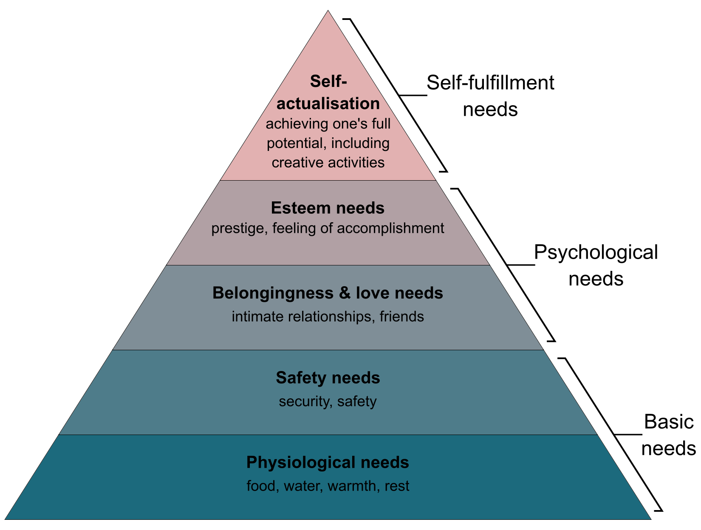

## The Five Basic Needs[^1]

1. [Physiological Needs](physiological-needs-052321)
2. [Safety Needs](safety-needs-052321)
3. [Belongingness and Love Needs](belongingness-love-needs-052321)
4. [Esteem Needs](esteem-needs-052321)
5. [Self-actualization](self-actualization-052321)

## footnotes

[^1]: There have been many extended applications beyond these four needs, and even Maslow himself later realized that self-actualization *wasn't* necessarily the final step in a fulfilled life. As [Kaltko-Rivera](kaltko-rivera-2006) points out, Maslow was interested in the spiritual idea of self-transcendence as a step beyond self-actualization.
